# FontAwesome Icons

This document provides a list of Font Awesome icons used in the project, along with their details.

## How to Use

1. **Icon**: A visual representation of the icon.
2. **Icon Name**: The name of the icon in Font Awesome.
3. **File Name**: The file name of the icon.
4. **Where We Get the Icon**: The source URL where the icon can be found.
5. **Where We Use the Icon**: The part of the project where the icon is used.

# FontAwesome Icons

This document provides a list of Font Awesome icons used in the project, along with their details.

| #  | Icon | Icon Name | File Name | Where We Get the Icon | Where We Use the Icon |
|----|------|-----------|-----------|-----------------------|-----------------------|
| 1  |  | `fa-arrow-up-right-from-square` | arrow-up-right-from-square.svg | [Font Awesome](https://fontawesome.com/icons) | Menu |
| 2  | 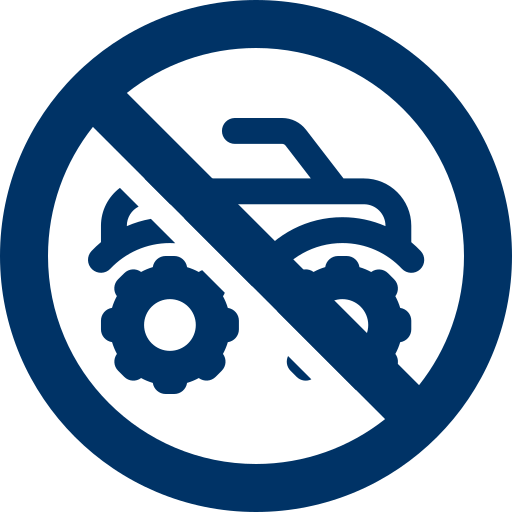 |  | atv-ban.svg | Custom icon | Park page, Visitor guidelines |
| 3  |  | `fa-ship` | aquatic-invasives.svg | [Font Awesome](https://fontawesome.com/icons) | Park page, Visitor guidelines |
| 4  | 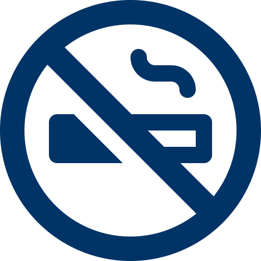 | `fa-ban-smoking` | ban-smoking.svg | [Font Awesome](https://fontawesome.com/icons) | Park page, Visitor guidelines |
| 5  |  | `fa-ban` | ban.svg | [Font Awesome](https://fontawesome.com/icons) | Park page, TLDR |
| 6  | 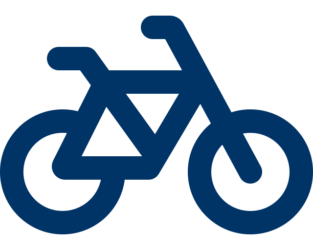 | `fa-bicycle` | bike-safety.svg | [Font Awesome](https://fontawesome.com/icons) | Park page, Visitor guidelines |
| 7  |  | `fa-boat-responsibly` | boat-responsibly.svg | [Font Awesome](https://fontawesome.com/icons) | Park page, Visitor guidelines |
| 8  | 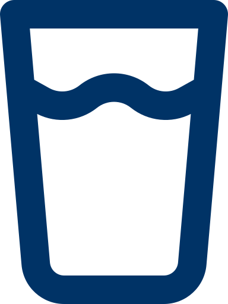 | `fa-boil-water` | boil-water.svg | [Font Awesome](https://fontawesome.com/icons) | Park page, Visitor guidelines |
| 9  | 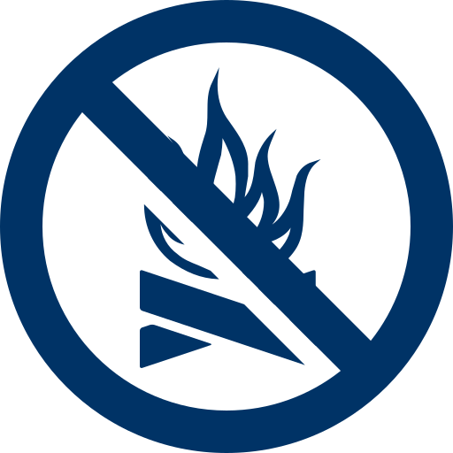 |  | campfire-ban.svg | Parks Canada | Park page, Visitor guidelines |
| 10 | 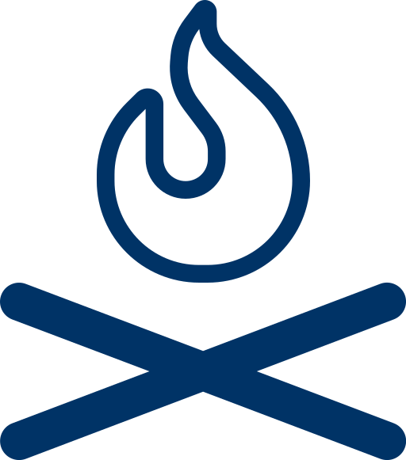 |  | campfire-safety.svg | Custom icon | Park page, Visitor guidelines |
| 11 | 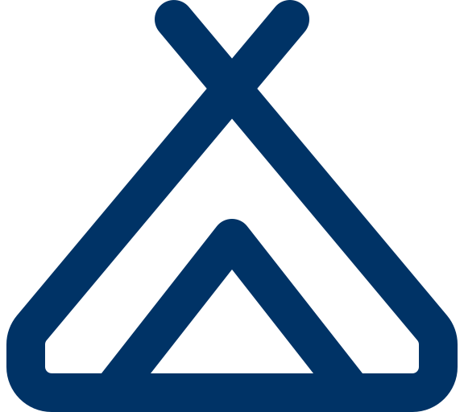 | `fa-campground` | campground.svg | [Font Awesome](https://fontawesome.com/icons) | Park page, Camping |
| 12 | 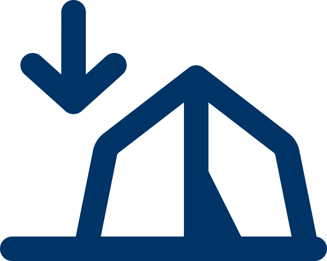 | `fa-camping-sites` | camping-sites.svg | [Font Awesome](https://fontawesome.com/icons) | Park page, Visitor guidelines |
| 13 |  | `fa-cellphone-unavailable` | cellphone-unavailable.svg | [Font Awesome](https://fontawesome.com/icons) | Park page, Visitor guidelines |
| 14 |  | `fa-clipboard-list` | clipboard-list.svg | [Font Awesome](https://fontawesome.com/icons) | Park page, Visitor guidelines |
| 15 | 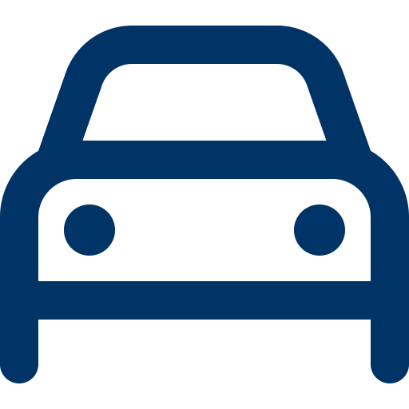 | `fa-drive-safely` | drive-safely.svg | [Font Awesome](https://fontawesome.com/icons) | Park page, Visitor guidelines |
| 16 | 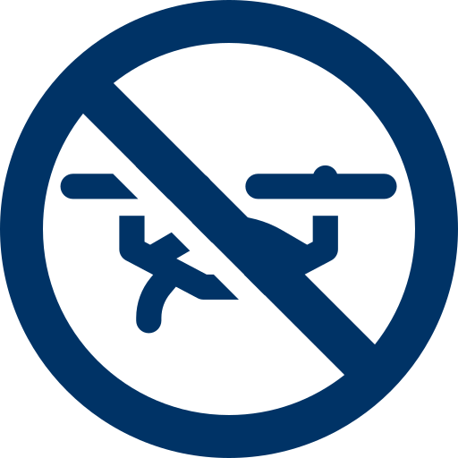 |  | drone-ban.svg | Custom icon | Park page, Visitor guidelines |
| 17 |  | `fa-droplet` | droplet.svg | [Font Awesome](https://fontawesome.com/icons) | Park page, Visitor guidelines |
| 18 |  | `fa-electrical-hookup` | electrical-hookup.svg | [Font Awesome](https://fontawesome.com/icons) | Park page, Visitor guidelines |
| 19 |  | `fa-envelope` | envelope.svg | [Font Awesome](https://fontawesome.com/icons) | Park page, Contact |
| 20 |  | `fa-equipment-rental` | equipment-rental.svg | [Font Awesome](https://fontawesome.com/icons) | Park page, Visitor guidelines |
| 21 |  | `fa-facebook` | facebook.svg | [Font Awesome](https://fontawesome.com/icons) | Park page, Contact |
| 22 |  | `fa-garbarge-unavailable` | garbarge-unavailable.svg | [Font Awesome](https://fontawesome.com/icons) | Park page, Visitor guidelines |
| 23 |  | `fa-generator-use` | generator-use.svg | [Font Awesome](https://fontawesome.com/icons) | Park page, Visitor guidelines |
| 24 |  | `fa-generic-information` | generic-information.svg | [Font Awesome](https://fontawesome.com/icons) | Park page, Visitor guidelines |
| 25 | 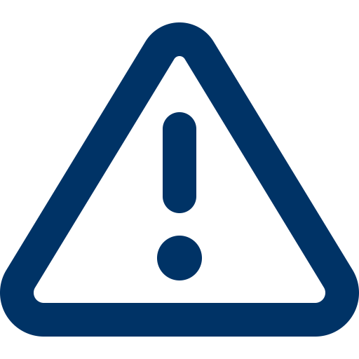 | `fa-generic-warning` | generic-warning.svg | [Font Awesome](https://fontawesome.com/icons) | Park page, Visitor guidelines |
| 26 | 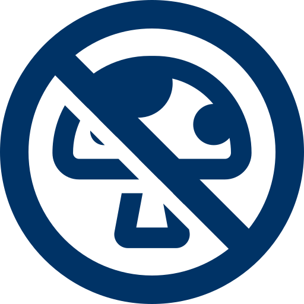 |  | harvesting-ban.svg | Custom icon | Park page, Visitor guidelines |
| 27 |  | `fa-instagram` | instagram.svg | [Font Awesome](https://fontawesome.com/icons) | Park page, Contact |
| 28 |  | `fa-laptop` | laptop.svg | [Font Awesome](https://fontawesome.com/icons) | Park page, Contact |
| 29 |  | `fa-leavenotrace-ethics` | leavenotrace-ethics.svg | [Font Awesome](https://fontawesome.com/icons) | Park page, Visitor guidelines |
| 30 | 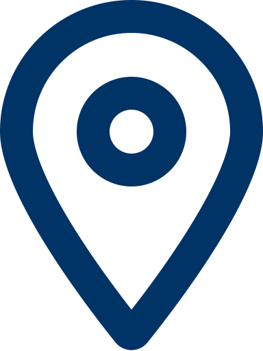 | `fa-location-dot` | location-dot.svg | [Font Awesome](https://fontawesome.com/icons) | Park page, TLDR |
| 31 |  | `fa-messages` | messages.svg | [Font Awesome](https://fontawesome.com/icons) | Park page, Contact |
| 32 | 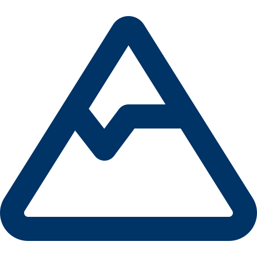 | `fa-mountain` | mountain.svg | [Font Awesome](https://fontawesome.com/icons) | Park page, Visitor guidelines |
| 33 |  | `fa-music` | music.svg | [Font Awesome](https://fontawesome.com/icons) | Park page, Visitor guidelines |
| 34 | 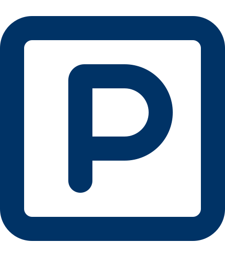 | `fa-parking-vehicles` | parking-vehicles.svg | [Font Awesome](https://fontawesome.com/icons) | Park page, Visitor guidelines |
| 35 |  | `fa-paw-claws` | paw-claws.svg | [Font Awesome](https://fontawesome.com/icons) | Park page, Visitor guidelines |
| 36 |  | `fa-person-falling` | person-falling.svg | [Font Awesome](https://fontawesome.com/icons) | Park page, Visitor guidelines |
| 37 |  | `fa-pet-safety` | pet-safety.svg | [Font Awesome](https://fontawesome.com/icons) | Park page, Visitor guidelines |
| 38 |  | `fa-phone-arrow-up-right` | phone-arrow-up-right.svg | [Font Awesome](https://fontawesome.com/icons) | Park page, Visitor guidelines |
| 39 |  | `fa-phone` | phone.svg | [Font Awesome](https://fontawesome.com/icons) | Park page, Contact |
| 40 |  | `fa-private-campsites` | private-campsites.svg | [Font Awesome](https://fontawesome.com/icons) | Park page, Visitor guidelines |
| 41 |  | `fa-quiet-hours` | quiet-hours.svg | [Font Awesome](https://fontawesome.com/icons) | Park page, Visitor guidelines |
| 42 |  | `fa-recycle` | recycle.svg | [Font Awesome](https://fontawesome.com/icons) | Park page, Visitor guidelines |
| 43 |  | `fa-reservations-required` | reservations-required.svg | [Font Awesome](https://fontawesome.com/icons) | Park page, Visitor guidelines |
| 44 |  | `fa-security-patrol` | security-patrol.svg | [Font Awesome](https://fontawesome.com/icons) | Park page, Visitor guidelines |
| 45 | 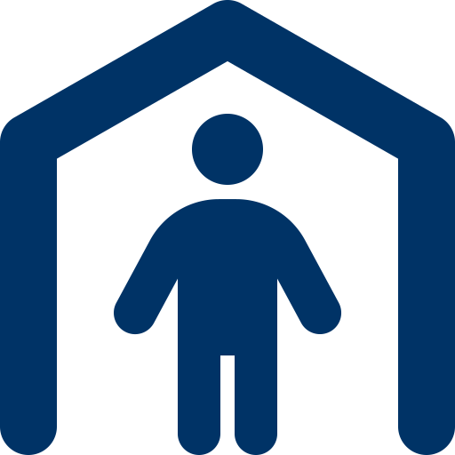 | `fa-shelter-available` | shelter-available.svg | [Font Awesome](https://fontawesome.com/icons) | Park page, Visitor guidelines |
| 46 |  | `fa-shop-available` | shop-available.svg | [Font Awesome](https://fontawesome.com/icons) | Park page, Visitor guidelines |
| 47 | 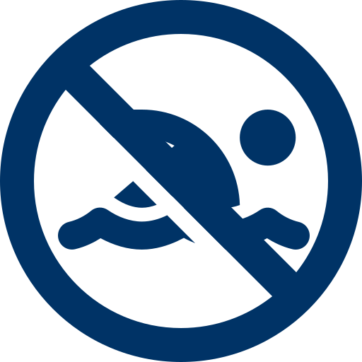 |  | swimming-ban.svg | Custom icon | Park page, Visitor guidelines |
| 48 | 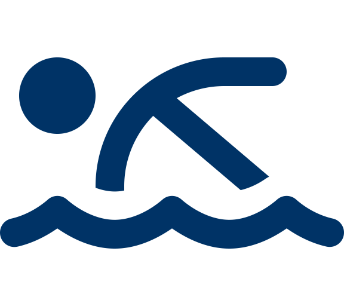 | `fa-swimming-safety` | swimming-safety.svg | [Font Awesome](https://fontawesome.com/icons) | Park page, Visitor guidelines |
| 49 | 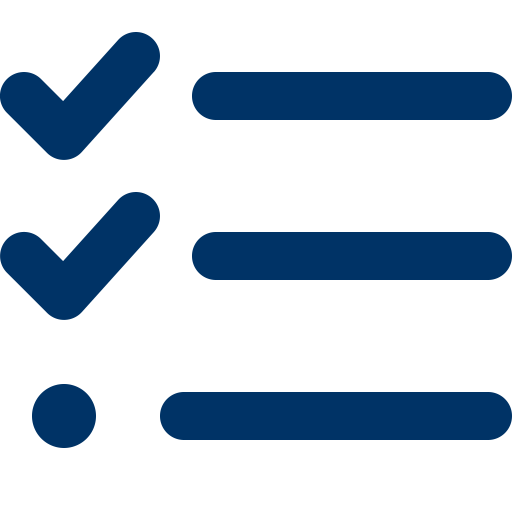 | `fa-trail-report` | trail-report.svg | [Font Awesome](https://fontawesome.com/icons) | Park page, Visitor guidelines |
| 50 |  | `fa-trail-safety` | trail-safety.svg | [Font Awesome](https://fontawesome.com/icons) | Park page, Visitor guidelines |
| 51 |  | `fa-trash-can` | trash-can.svg | [Font Awesome](https://fontawesome.com/icons) | Park page, Visitor guidelines |
| 52 |  | `fa-triangle-exclamation` | triangle-exclamation.svg | [Font Awesome](https://fontawesome.com/icons) | Park page, Visitor guidelines |
| 53 |  | `fa-trip-plan` | trip-plan.svg | [Font Awesome](https://fontawesome.com/icons) | Park page, Visitor guidelines |
| 54 |  | `fa-wildlife-safety` | wildlife-safety.svg | [Font Awesome](https://fontawesome.com/icons) | Park page, Visitor guidelines |
| 55 |  | `fa-winter-conditions` | winter-conditions.svg | [Font Awesome](https://fontawesome.com/icons) | Park page, Visitor guidelines |
| 56 |  | `fa-x-twitter` | x-twitter.svg | [Font Awesome](https://fontawesome.com/icons) | Park page, Contact |